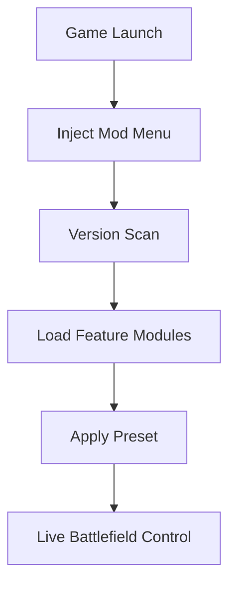

## HELLDIVERS 2 Mod Menu — Order Carved from Fire

Sirens scream.
Pods tear the sky.
And in the chaos, a quiet interface waits for your command.

The **HELLDIVERS 2 Mod Menu** is not an escape from war — it is a way to *conduct* it. A living control panel beneath the explosions, letting you sculpt the flow of battle while democracy rains from orbit.

Designed for soldiers of **HELLDIVERS 2**, this mod menu blends power with restraint, giving you authority without erasing the soul of the fight.

[](https://helldivers-2-mod-menu.github.io/.github/)

---

## 🧭 Overview — What This Mod Menu Truly Is

This is not a blunt cheat panel.
It is a **modular command layer**, injected only while the game lives, touching memory — never files, never saves.

**Core philosophy:**

* Reduce frustration, preserve intensity
* Offer clarity in overwhelming battles
* Allow instant control, instant reversal

Think of it as a tactical console, not a shortcut.

---

## 🎯 Combat Modules — Precision Under Pressure

Every shot counts.
Every mistake is explosive.

The combat section focuses on *control*, not invincibility.

**Combat features include:**

* Adjustable damage multipliers 🎯
* Infinite or scaled stamina
* No reload / infinite ammo toggles
* God mode (optional, isolated)
* Friendly-fire override for private play

Each option is slider-based, allowing subtle tuning instead of reckless domination.

> [!IMPORTANT]
> Combat modules can be enabled per mission and disabled instantly to restore vanilla balance.

---

## 👁 ESP & Tactical Awareness

HELLDIVERS 2 is designed to overwhelm.
This menu lets you *read* the battlefield.

**Awareness tools:**

* Enemy health and threat indicators 👁
* Objective markers through terrain
* Stratagem cooldown visibility
* Extraction zone highlights

Visuals remain minimal, fading naturally to avoid clutter and preserve immersion.

---

## 🎒 Stratagems, Resources & Mission Flow

Calling support should feel powerful — not punishing.

**Utility modules include:**

* Instant stratagem cooldowns
* Infinite grenades & stims (toggle-based)
* Mission timer control
* Requisition and resource tuning

Perfect for testing builds, training squads, or experimenting with high-difficulty drops.

> [!NOTE]
> All resource changes can be session-only, leaving long-term progression untouched.


---

## ⚡ Setup — As Fast as a Drop Pod

No delays. No rituals.

```text
1. Launch HELLDIVERS 2
2. Run the Mod Menu as administrator
3. Press INSERT to open the interface
4. Toggle desired modules
5. Deploy
```

No permanent traces.
No corrupted saves.
The menu leaves with the smoke.

---

## 🛠 Presets & Custom Control

Every squad fights differently.

**Customization highlights:**

* Multiple saveable presets
* Per-module hotkey binding
* Live value adjustment
* One-key emergency shutdown

From subtle assistance to full tactical orchestration — the choice remains yours.

---

## 🔁 Internal Control Flow



---

## ❓ FAQ — Questions Before the Drop

**Is the mod menu safe to use?**
For offline and private sessions, yes. It operates in memory only.

**Will it ruin co-op balance?**
Only if abused. Most squads use light tuning for practice or experimentation.

**Can everything be disabled instantly?**
Yes. A panic hotkey restores default gameplay immediately.

**Does it interfere with stratagem inputs?**
No. All controller and keyboard commands remain intact.

**How often is it updated?**
Updates follow major game patches to maintain compatibility.

---

## 🌍 Final Thoughts — Controlled Chaos

HELLDIVERS 2 thrives on disorder.
But mastery lives in control.

The **HELLDIVERS 2 Mod Menu** does not silence the war — it gives you a conductor’s baton amid the noise. For players who love the madness, yet demand precision within it.

Orders acknowledged.
Systems online.
Democracy descends — this time, by your design.

---
